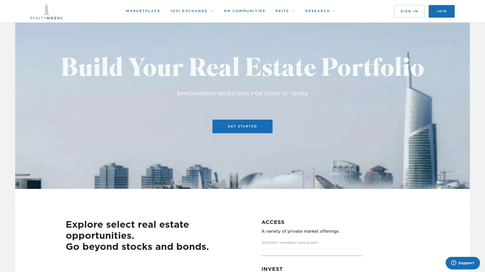
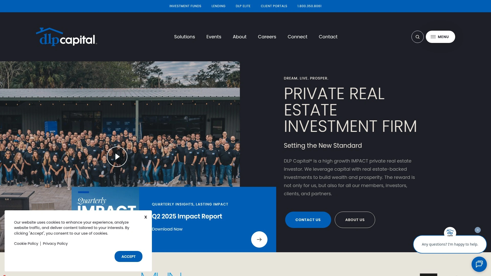

# 20 Best Real Estate Investment Platforms: No Landlord Hassles, Earn Passive Income!

Real estate investing used to mean huge capital and tenant headaches, but **2025’s online platforms have changed the game**. Now everyday investors can **diversify into property assets** without buying a house outright – **gaining passive income** from rentals or interest with **far lower minimums**. Whether you’re an accredited investor chasing higher returns or a beginner building wealth with spare change, these curated **real estate crowdfunding platforms** offer **hassle-free portfolio growth** and access to opportunities once reserved for industry insiders. Get ready to explore **20 top platforms** that make real estate investing **easier, more affordable, and more convenient than ever**.

## **[EquityMultiple](https://equitymultiple.com)**
*Modern commercial real estate access for accredited investors.*

**EquityMultiple** focuses on high-quality commercial real estate deals – think apartment complexes, office buildings, and industrial properties vetted by experts. It lets **accredited investors** pool funds into professionally managed projects, **starting around $5,000** minimum. The platform stands out for its **thorough due diligence** (they accept only ~5% of proposed deals) and **hands-on asset management** on each investment. Investors can choose from **multiple deal types** – short-term loans, preferred equity, or equity stakes – to balance cash flow and growth. **Why we recommend it:** EquityMultiple provides **institutional-grade opportunities** with **transparent reporting**, ideal if you want big-league real estate exposure without managing anything yourself. It’s a one-stop shop to **earn passive income** from commercial real estate **with confidence**, making it our #1 pick for experienced investors seeking **steady returns and diversification**.

## **[Fundrise](https://fundrise.com)**
*Real estate investing for everyone, with ultra-low minimums.*

**Fundrise** is one of the most popular platforms because it’s **beginner-friendly and open to non-accredited investors**. You can start with **just $10**, making it easy to dip your toes into real estate. Fundrise pools investor money into its own diversified portfolios (eREITs and funds) of residential and commercial properties across the U.S. – meaning you get **instant diversification** even with a small investment. The platform emphasizes a **simple, automated approach**: choose a plan based on your goals (income, growth, or balanced), and Fundrise’s team handles property acquisition, management, and even reinvestment of your dividends if you opt in. Investors earn **quarterly dividends** from rental income and interest, plus potential appreciation when properties are sold. With an intuitive app and **transparent performance updates**, Fundrise makes real estate investing as **set-and-forget** as it gets, **turning landlord hassles into easy passive income** for over 2 million users.

## **[RealtyMogul](https://www.realtymogul.com)**
*Marketplace offering both private deals and public REITs.*

**RealtyMogul** provides a versatile platform for real estate investing with options for **all investor types**. If you’re non-accredited, you can invest in RealtyMogul’s **private REITs** (MogulREIT I and II) with a minimum around $5,000 – these funds pay **consistent monthly or quarterly distributions** and target different strategies (one is income-focused, another aims for growth through apartments). Accredited investors, on the other hand, get access to **individual property deals** on the marketplace, ranging from apartment buildings to self-storage facilities, typically with minimums of $25,000. RealtyMogul prides itself on **carefully vetted offerings** and has a track record going back to 2013. The platform’s due diligence and ongoing asset management help reduce risk, and they provide **detailed updates and financial reports** for each investment. In short, RealtyMogul is a **trusted one-stop platform** whether you want a simple REIT for passive income or prefer to **hand-pick specific real estate projects** to fund.

## **[CrowdStreet](https://www.crowdstreet.com)**
*High-end commercial projects for seasoned, accredited investors.*

For accredited investors seeking **premium commercial real estate deals**, **CrowdStreet** is a go-to marketplace. It features a wide array of offerings from vetted real estate developers and operators – from luxury apartment complexes and office towers to industrial parks and mixed-use developments. The typical investment minimum is higher (often **$25,000 or more**), and in return you gain access to **institutional-quality deals** that historically might only be available through private equity. CrowdStreet’s platform is known for rich detail: each deal listing provides extensive financial projections, business plans, location analyses, and often live webinars with the project sponsors. This helps investors perform their own due diligence. You can build a custom portfolio targeting specific locations or property types, or even invest in CrowdStreet’s **blended funds** for instant diversification. While the projects usually have multi-year holding periods, the potential returns (income + appreciation) have attracted many experienced investors. If you’re comfortable with higher stakes, CrowdStreet offers **direct access to big-league real estate** and a chance to **co-invest alongside seasoned pros** in marquee developments.

## **[Yieldstreet](https://www.yieldstreet.com)**
*Alternative investments platform, with real estate and more.*

**Yieldstreet** broadens your horizons beyond traditional real estate – it’s an alternative investment platform where you can fund everything from real estate loans to art portfolios and legal finance. For real estate specifically, Yieldstreet offers debt deals like **short-term real estate-backed loans** (providing steady interest income) and occasionally equity deals or funds. Many offerings are open to **non-accredited investors** as well (they have a Yieldstreet Prism Fund with a minimum around $500), though some individual deals require accreditation. The appeal of Yieldstreet is **diversification**: within one account you might invest in an apartment building loan, a basket of commercial properties, and even non-real-estate assets like fine art or marine vessels. Returns vary by product, but real estate notes often target yields in the high single digits with 1–3 year durations. The platform is user-friendly, provides thorough asset descriptions, and **manages all the complexity** of collections and distributions for you. If you’re looking for passive income and want to **spread your bets across multiple alternative assets** (including real estate), Yieldstreet is a convenient, innovative solution.

## **[Groundfloor](https://groundfloor.com)**
*Short-term real estate debt for anyone, with just $10 to start.*

**Groundfloor** takes a unique approach: it lets investors **crowdfund fix-and-flip loans** for home renovations and new construction. With **minimum investments as low as $10 per loan**, **any investor (non-accredited welcome)** can get in on the action. Here’s how it works: real estate developers borrow money from Groundfloor’s community to finance their property projects (usually single-family home rehabs). In return, investors earn a high interest rate, typically around 8-12%, paid back over a short term (6–12 months on average). Each loan is assigned a grade (A through G) indicating its risk/return profile – you can **pick and choose loans** individually or use Groundfloor’s automated strategy to allocate your funds. The key advantage is **liquidity and control**: because loans are short-term, you get your principal and interest back relatively quickly, and you can reinvest or withdraw. Groundfloor even offers a secondary market (called Notes Trading) where you might sell loans if you need to exit early. All of this makes Groundfloor a great tool for investors who want **faster turnaround** and **hands-on selection** in real estate investing, without the long multi-year commitments of equity deals.

## **[Roofstock](https://www.roofstock.com)**
*Marketplace for buying rental homes (with tenants in place).*

Unlike most on this list, **Roofstock** isn’t about pooled crowdfunding – it’s an **online marketplace to buy and sell tenant-occupied single-family rental properties**. Essentially, Roofstock helps investors become landlords **minus the usual hassle** of finding properties or screening tenants. Listings on Roofstock include detailed financials: you can see the current rent, tenant lease terms, property inspection reports, and neighborhood ratings. Many homes are sold with a renter already in place, meaning you start collecting rent from **day one after purchase**. While buying an entire property requires more capital (down payments or full cash purchases in the tens of thousands), Roofstock streamlines the process and reduces fees compared to traditional real estate brokers. They also offer connections to **property management services** so you can own a rental home anywhere in the U.S. and have it professionally managed. For those who prefer **direct ownership of real property** and the **ability to build equity over time**, Roofstock provides an easy, transparent way to acquire rental houses in strong markets. It’s a perfect platform if you want the benefits of being a landlord – rental income, property appreciation – **without having to scour listings or live near your investment**.

## **[Arrived Homes](https://arrived.com)**
*Fractional ownership of rental homes with just $100.*

**Arrived Homes** makes it simple to become a landlord **without the responsibilities**. This platform allows anyone (non-accredited investors included) to **buy fractional shares of rental properties**. Arrived acquires single-family homes (and recently vacation rentals as well), then lets investors purchase shares in the LLC that owns each home. You can invest as little as **$100 per property**, making it easy to spread a few hundred dollars across multiple homes in different cities. As a shareholder, you’ll receive **quarterly rental income dividends** proportional to your ownership, and you’ll participate in any **appreciation** when the property is eventually sold (Arrived targets a 5-7 year hold, but there’s no action needed on your part – they handle the sale). The platform shines for its **user-friendly interface and low barrier to entry**. Each listing shows projected returns, tenant info, and market stats so you can make an informed choice. Arrived Homes essentially lets you **invest in real estate like buying stocks** – pick properties you like, invest a small amount, and enjoy truly passive income while their team handles all the landlord duties (from finding tenants to maintenance). It’s an ideal option for newcomers building a **diversified rental portfolio** one slice at a time.

## **[Cadre](https://cadre.com)**
*Institutional-quality commercial real estate with an liquidity option.*

**Cadre** is tailored for accredited investors seeking **elite commercial real estate deals** and a bit more flexibility. The platform offers carefully curated investments in office buildings, apartments, hotels, and other large-scale projects – the kind typically dominated by institutions. Cadre’s minimums often start around $25,000, and they emphasize quality over quantity, presenting only a handful of new deals at a time after rigorous vetting. One hallmark feature is Cadre’s **Secondary Market**: after an initial lock-in period (usually 6 months to a year), investors can **sell their position** in a deal to other Cadre members during designated trading windows. This provides a potential exit before the property itself is sold, introducing liquidity rarely seen in private real estate. Cadre also offers a managed **Cadre Direct Access Fund** for those who want instant diversification across multiple properties with one investment. With a sleek interface, detailed research on each deal, and a track record of strong performance, Cadre appeals to savvy investors who want **direct access to top-tier commercial real estate** plus a **chance to rebalance or cash out earlier** than a typical holding period. It’s like a bridge between the private real estate world and a more liquid exchange.

## **[DiversyFund](https://www.diversyfund.com)**
*Hands-off multifamily investing for the everyday investor.*

**DiversyFund** is a platform that builds and manages its own real estate portfolios, focusing on **value-add multifamily apartment complexes** – and anyone can join the ride since **no accreditation is required**. When you invest with DiversyFund (minimum as low as $500), your money goes into the DiversyFund Growth REIT, which uses the funds to acquire and improve apartment buildings. What’s unique is that DiversyFund doesn’t charge any platform or management fees to investors; they earn their upside by sharing profits only after investors receive a preferred return. All dividends from rental income are automatically **reinvested** into the fund’s projects to accelerate growth, meaning you won’t get quarterly cash payouts, but your investment value compounds until the properties are eventually sold (target hold ~5 years). This approach is great for those focused on **long-term wealth building**. DiversyFund provides updates on property renovations and performance, so you can track progress. It’s essentially a **set-it-and-forget-it** model – you put in capital, they do all the work of increasing property values, and you share in the profits at the end. For investors who want exposure to apartment investments without picking individual deals or paying high fees, DiversyFund offers a **simple, low-cost entry into multifamily real estate**.

## **[Streitwise](https://streitwise.com)**
*High-yield commercial real estate fund with consistent dividends.*

**Streitwise** is a straightforward way to invest in income-producing commercial real estate, open to both accredited and non-accredited investors. The company manages a single flagship REIT that has historically invested in **office buildings and mixed-use properties** in secondary markets (think thriving mid-sized cities). With a minimum investment of **around $5,000**, you become a shareholder in their real estate portfolio. Streitwise has made a name for itself by delivering **steady, attractive dividends** – often in the range of 8-9% annual yield – paid quarterly. They achieve this by focusing on properties with strong tenants and locking in longer-term leases that generate reliable cash flow. As a truly passive investment, you don’t have to worry about reinvesting dividends or any maintenance; the fund automatically handles everything while you collect checks and watch the portfolio’s value (hopefully) appreciate over time. Transparency is also a plus: Streitwise regularly publishes updates and financials, and the founders invest their own money in the fund, aligning interests with investors. If you’re seeking **stable passive income** from commercial real estate but prefer a **conservative, slow-and-steady strategy**, Streitwise is a compelling choice with a proven track record.

## **[First National Realty Partners](https://fnrpusa.com)**
*Niche focus on grocery-anchored commercial centers (accredited investors).*

**First National Realty Partners (FNRP)** specializes in a specific and resilient corner of the real estate market: **grocery-anchored shopping centers**. These are neighborhood retail centers where a major supermarket (think Kroger, Publix, Walmart Neighborhood Market, etc.) serves as the key tenant alongside a mix of other shops and services. Accredited investors can join FNRP’s deals, typically structured as partnerships or funds that acquire these commercial properties. The idea is to capitalize on the steady foot traffic and essential-service nature of grocery tenants, which tend to make these investments **more recession-resistant**. FNRP usually targets properties with existing cash flow, so investors often begin receiving **distribution checks shortly after investing**, funded by tenants’ rent. They also work on adding value – for example, by bringing in new national-brand tenants or improving occupancy – which can boost the property’s income and value over time. Minimum investments might be in the ~$50K range, as FNRP’s deals are sizeable. Investors get detailed quarterly updates and access to an online portal to track performance. If you’re looking for **commercial real estate that prioritizes cash income and stability**, FNRP’s focused strategy in grocery-anchored centers offers a compelling, income-oriented investment niche.

## **[DLP Capital](https://dlpcapital.com)**
*High-yield real estate funds with an innovative, impact-driven approach.*

**DLP Capital** is a real estate investment firm offering a variety of **high-yield funds and strategies** to accredited investors. DLP is known for targeting opportunities that generate strong cash flow – for instance, they have funds that provide financing to other real estate operators, invest in rental communities, or acquire distressed properties to turn around. Many DLP projects revolve around the **workforce housing** space (affordable apartments and homes), aiming to both do social good and tap into a very stable demand segment. Investors usually need to commit a minimum (often $100k for some funds), and in return DLP often provides **monthly distributions** and attractive preferred returns (their flagship lending fund, for example, has paid out around 10% annually in income). The firm touts a track record of consistent performance through various market conditions, partly due to their vertically integrated model – they often handle development, property management, and even real estate brokerage in-house. DLP also has an “Elite” membership community with resources for investors, reflecting their hands-on, relationship-driven ethos. In short, DLP Capital is a fit for those who want **actively managed, diversified real estate funds** aiming for **above-average yields**, and who appreciate a company that combines profit with an eye on solving housing challenges.

## **[FarmTogether](https://farmtogether.com)**
*Invest in U.S. farmland – reap the rewards of agriculture.*

**FarmTogether** opens the door for accredited investors to own a piece of **income-producing farmland**, an asset class known for its stability and inflation-hedging traits. Through FarmTogether’s platform, you can invest in specific farm deals – for example, a California almond orchard or a midwest corn farm – typically with minimums around $15,000. The platform handles all the heavy lifting: they partner with experienced farm operators who work the land, and as an investor you receive a share of the farm’s profits. Returns usually come from two sources: **annual income from crop sales or land leases** (distributed to investors, often annually or quarterly) and **land value appreciation** over the holding period (farmland tends to increase in value over time, and the property is sold after 5-12 years, giving investors a payout). FarmTogether also offers a **Sustainable Farmland Fund** option for broader exposure. What sets this apart is the chance to diversify outside of traditional real estate – farmland returns don’t swing in tandem with stock markets or even commercial property markets. Plus, there’s something satisfying about supporting agriculture and **sharing the harvest profits**. FarmTogether’s due diligence includes on-site farm visits and financial modeling to select only solid opportunities. If you’re an accredited investor looking for **steady, long-term growth and passive income** (imagine getting paid as the crops grow), farmland could be a savvy addition, and FarmTogether makes it **accessible online**.

## **[HappyNest](https://myhappynest.com)**
*Real estate investment app that lets you start with just $10.*

**HappyNest** is a mobile-first real estate investing app designed for **beginners and casual investors** to get into the market easily. With **only $10 needed to start**, you can buy shares of HappyNest’s private REIT, which holds a mix of commercial real estate properties. They often invest in stable, income-producing assets like warehouses, retail centers, or office buildings leased to well-known companies (for example, their portfolio has included properties rented by FedEx and CVS). Investors earn **quarterly dividends** from the rental income these properties generate. One cool feature: HappyNest allows you to link a credit/debit card and **round up your everyday purchases** into micro-investments – essentially helping you automatically funnel spare change into real estate shares. This makes building your investment almost effortless over time. The app itself is simple and intuitive, showing your portfolio balance, earned dividends, and educational content to learn the ropes. HappyNest has low fees and a long-term mindset; while you can request to redeem shares, ideally you’ll let your money grow alongside the properties’ values. For anyone who wants to **start small, set up good savings habits, and slowly grow a passive income stream** through real estate, HappyNest is a perfect “set it and forget it” solution.

## **[Concreit](https://concreit.com)**
*Automated real estate fund with weekly payouts and low minimum.*

**Concreit** offers a modern take on real estate investing by combining **technology, low barriers, and frequent payouts**. It’s open to all investors (no accreditation needed) and allows you to start with a very low minimum (often just **$1 or $5 to begin**). When you invest in Concreit, you’re buying into a **diversified fund of real estate debt and equity investments** – essentially a managed portfolio of property loans and ownership stakes, spread across many regions and property types. The platform’s standout feature is its **weekly dividend** payouts; instead of waiting quarterly or annually, Concreit credits your share of rental or interest income to your account every week, giving you that satisfying drip of passive income. You can withdraw dividends or reinvest them automatically to compound. Concreit’s app makes everything easy: you set financial goals (like “earn $X per month” or “save for a house down payment”), enable recurring contributions if you want, and track your progress in real time. Importantly, Concreit emphasizes **liquidity** – while it’s not as liquid as a savings account, they do allow investors to request withdrawals of principal on a weekly basis (subject to certain limits and available cash), providing more flexibility if you need funds back before the typical multi-year horizon. For those who want a **truly hands-off investment with regular income**, Concreit feels almost like a “real estate savings account”: your money is working in property markets behind the scenes, and you get **steady payouts** and can monitor growth from your phone.

## **[Cityfunds](https://www.cityfunds.com)**
*Bet on the housing market of your favorite city.*

  
  
**Cityfunds** (offered by Nada) let everyday investors buy into the **home equity of entire cities**. This innovative platform has created index-like funds for specific metropolitan areas – for example, Cityfunds for Austin, Dallas, Tampa, and so on. When you invest (open to non-accredited investors, minimum typically a few hundred dollars), your money is used to purchase fractional ownership in many single-family homes in that city or provide equity-sharing loans to homeowners. The result: your investment’s value rises and falls with the **overall home price appreciation in that city’s housing market**. If you believe Austin home values will boom, for instance, you can put some money into the Austin Cityfund and effectively **ride the wave of that local real estate market** without having to buy a single house. Cityfunds pay **quarterly dividends** if there’s rental or interest income from their portfolio, and of course you benefit from any property sales or appreciation gains the fund realizes. This approach provides a level of diversification even within one city (since the fund holds stakes in multiple homes). It’s also quite liquid relative to traditional real estate – Nada has facilitated a trading bulletin board where investors can **buy/sell Cityfund shares** with others, providing a potential exit before the fund liquidates assets. For investors who want to **target specific regions** or just like the idea of real estate exposure akin to a stock index, Cityfunds offer a **flexible, focused way to invest in residential real estate trends**.

## **[AKRU](https://www.akru.co)**
*Blockchain-powered fractional commercial real estate investing.*

**AKRU** combines real estate with blockchain technology to democratize access to **fractional commercial property investments**. Aimed at accredited investors, AKRU’s platform tokenizes ownership of real estate assets – for example, an office building might be divided into digital shares (tokens) that investors can buy, sometimes with minimums as low as a few thousand dollars. This technology-driven approach brings a few key benefits. First, **lower investment minimums and easier access**: you can invest small amounts in large-scale properties that would otherwise be out of reach. Second, the possibility of **enhanced liquidity** – AKRU plans secondary trading of those tokens, so investors might trade their positions more readily, which is not common in traditional real estate. Each offering on the platform provides detailed financials, projected returns (rental income distributions plus potential appreciation), and an overview of the property and tenants. The underlying assets might include commercial buildings like multifamily complexes, retail centers, or industrial facilities. By leveraging blockchain for transparency and efficiency, AKRU reduces the costs and frictions of real estate transactions, ultimately aiming to let investors **build a diversified real estate portfolio with just a few clicks**. If you’re comfortable with cutting-edge fintech and want **flexibility and transparency** in real estate investing, AKRU is a pioneer worth looking at – it’s bringing the **“stocks-style” simplicity** to owning pieces of real properties.

## **[Kay Properties](https://www.kpi1031.com)**
*Specialist in 1031 exchange DST investments for passive income and tax deferral.*

**Kay Properties & Investments** operates a large **DST marketplace** – a platform for accredited investors to find and invest in **Delaware Statutory Trust (DST) offerings**. DSTs are a popular vehicle for 1031 exchanges, allowing investors who sell one property to reinvest proceeds into fractional shares of big, institutional-grade real estate (thus deferring capital gains tax). Even if you’re not doing a 1031 exchange, you can invest cash directly into DSTs via Kay Properties. The typical DST property might be something like a 300-unit apartment complex, a portfolio of Amazon-leased distribution centers, or a medical office building – high-quality assets managed by professional sponsors. Minimums often start around $50,000 per DST. The beauty of DST investments is **truly passive income**: they usually pay **regular monthly distributions**, and as an investor you have no landlord duties or decision-making – the trust structure means everything is pre-packaged and managed for you. Kay Properties provides access to **20-40 different DST deals at any given time**, from various sponsor companies, so investors can diversify across property types and geographies. Their team also offers personalized guidance to help match investors with the right DSTs based on financial goals. In short, if you’re looking to **reinvest real estate profits without the headaches of direct ownership** (and potentially save on taxes via a 1031), Kay Properties is a premier platform to explore **stable, income-focused opportunities** in big-ticket real estate assets.

## **[Trion Properties](https://trionproperties.com)**
*Experienced multifamily investment sponsor with strong track record (accredited investors).*

**Trion Properties** is a bit different from the online “marketplaces” – it’s an **active real estate sponsor** that syndicates deals and manages them in-house, focusing on **multifamily apartment complexes** primarily in the U.S. West Coast and Southeast. Through Trion’s platform, accredited investors can invest in their offerings, which include individual property syndications and their diversified **Income Plus Fund**. The company has a hands-on, value-add strategy: they buy underperforming or underutilized apartment communities, then renovate units, upgrade amenities, and improve management to increase rental income and property value. Trion has a strong track record of delivering high returns (they often cite historical annualized returns well above 15% on past deals) – of course, future results can vary, but it speaks to their expertise in execution. Investors typically benefit from **quarterly cash flow distributions** (from rental operations) and a share of profits when a property is refinanced or sold. Minimum investment levels might start around $50,000. As a sponsor-led investment, you’re trusting Trion’s team to drive performance; the upside is they are **highly aligned** (they often co-invest significant capital and only profit after investors receive preferred returns). If you’re an investor who prefers to partner with a **seasoned operator** with skin in the game, and you like the idea of owning a slice of apartment buildings in thriving markets, Trion Properties offers a **reliable, professional avenue** to do so without going it alone.

---

## **FAQ: Common Questions**

**Q1: Do I need to be an accredited investor to use these real estate platforms?**
**A1:** Not all – **some platforms are open to everyone**, while others are limited to accredited investors. For example, **Fundrise, Groundfloor, Arrived, Concreit,** and **DiversyFund** accept non-accredited investors (with very low minimums), whereas **EquityMultiple, CrowdStreet, Cadre,** or **FNRP** require accreditation. Always check each platform’s investor eligibility rules before you sign up.

**Q2: How do investors make money on these platforms?**
**A2:** You earn returns through **rental income, interest, and property appreciation**. Platforms will either pay you **regular distributions** (e.g. monthly or quarterly dividends from rent or loan interest) or **payouts at the end** of a project (when a property is sold or refinanced). Many offer a combination – for instance, you might get quarterly cash flow and also a profit split if the property’s value increases. Each deal’s page will outline the expected income streams and timing, so you know what to expect.

**Q3: How liquid are these investments? Can I withdraw early?**
**A3:** **Real estate is generally a long-term, illiquid investment** – you should be prepared to hold until the project completes (often 3-7 years for equity deals). However, a few platforms provide some liquidity options. For instance, **Cadre and Cityfunds** have secondary marketplaces where you might sell your stake to other investors, and **Groundfloor** loans pay back in months rather than years. Some platforms like Concreit also let you request withdrawals from their fund on a periodic basis. **Bottom line:** expect to stay invested for the recommended term, but know that certain platforms offer limited early exit opportunities if you need them.

---

In conclusion, the world of real estate investing is no longer reserved for moguls – with these **20 platforms**, anyone can start earning passive income from properties **without the headaches of being a landlord**. From $10 beginner apps to exclusive $50k opportunities, there’s an option for every strategy and budget. The key is to choose platforms that match your goals (income now vs. growth later, hands-on selection vs. auto-pilot). And if you’re aiming for high-caliber commercial deals with expert oversight, **[EquityMultiple](https://equitymultiple.com)** stands out as our top recommendation – it delivers institutional-quality real estate opportunities with a level of care and diligence perfect for investors seeking **reliable returns and truly passive exposure** to real estate. Happy investing, and may your portfolio grow as steadily as a well-located property!
